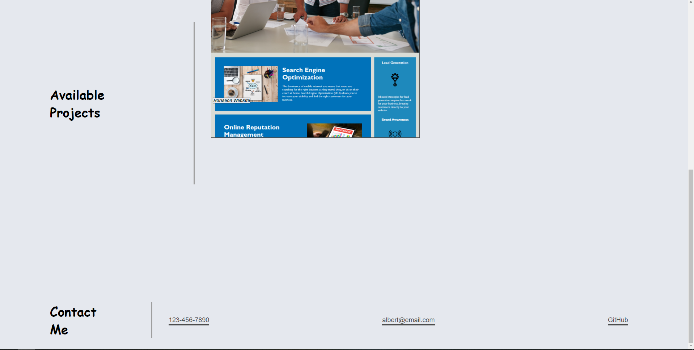

# Adv-CSS-Portfolio
 Deployed URL: https://albertcshih.github.io/Adv-CSS-Portfolio/
 
 TOP OF PAGE:
 
 
 BOTTOM OF PAGE:
 
 
 All buttons on the nav bar works to where the section of the page is located. I am able to add my Horiseon site onto the site but. Further projects will be added on in the future such as Run Buddy and group Project. 
